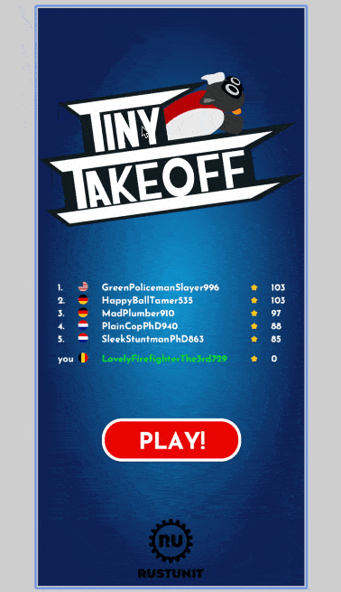

# bevy_web_popups

[![crates.io][sh_crates]][lk_crates]
[![docs.rs][sh_docs]][lk_docs]
[![discord][sh_discord]][lk_discord]

[sh_crates]: https://img.shields.io/crates/v/bevy_web_popups.svg
[lk_crates]: https://crates.io/crates/bevy_web_popups
[sh_docs]: https://img.shields.io/docsrs/bevy_web_popups
[lk_docs]: https://docs.rs/bevy_web_popups/latest/bevy_web_popups/
[sh_discord]: https://img.shields.io/discord/1176858176897953872?label=discord&color=5561E6
[lk_discord]: https://discord.gg/rQNeEnMhus

Allows to trigger web/dom based popups/alerts and textinput in bevy

See also:
[bevy_ios_iap](https://github.com/rustunit/bevy_ios_iap), [bevy_ios_gamecenter](https://github.com/rustunit/bevy_ios_gamecenter), [bevy_ios_notifications](https://github.com/rustunit/bevy_ios_notifications), [bevy_ios_alerts](https://github.com/rustunit/bevy_ios_alerts), [bevy_ios_review](https://github.com/rustunit/bevy_ios_review), [bevy_ios_impact](https://github.com/rustunit/bevy_ios_impact) & [bevy_device_lang](https://github.com/rustunit/bevy_device_lang)

See the crate in action in [TinyTakeoff](www.tinytakeoff.com):



## Features
* `window.alert()`
* fully cuntional popup dialog with background darkening with textinput, cancel and ok button, can be styled and customized

## Usage

Add dependency: `bevy_web_popups = "0.1"`

Initialize Bevy Plugin:

```rust
// request initialisation right on startup
app.add_plugins(WebAlertsPlugin);
```

```rust
fn bevy_system() {
    // trigger native browser alert message popup
    bevy_web_popups::alert("important msg");

    // trigger complex text input popup with a custom title, custom labels for the buttons and asking to spawn default css classes instead of specifying them ourselfs
    bevy_web_popups::show_textinput("set nickname:", "ok", "cancel", true);
}

// system processing events coming from the web plugin
fn process_events(
    mut events: EventReader<WebAlertResponse>,
) {
    for e in events.read() {
        if let WebAlertResponse::InputOk(text) = e {
            info!("user confirmed with text: {text}");
        }
    }
}
```

## Bevy version support

|bevy|bevy\_ios\_iap|
|---|---|
|0.13|0.1,main|

# License

All code in this repository is dual-licensed under either:

- MIT License (LICENSE-MIT or http://opensource.org/licenses/MIT)
- Apache License, Version 2.0 (LICENSE-APACHE or http://www.apache.org/licenses/LICENSE-2.0)

at your option. This means you can select the license you prefer.

## Your contributions
Unless you explicitly state otherwise, any contribution intentionally submitted for inclusion in the work by you, as defined in the Apache-2.0 license, shall be dual licensed as above, without any additional terms or conditions.
